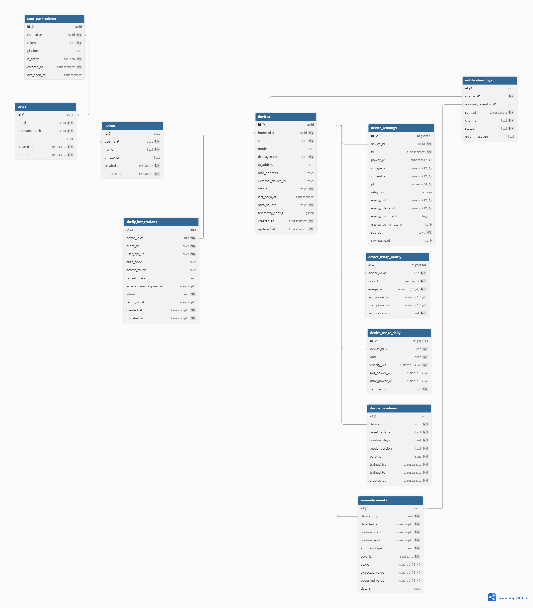
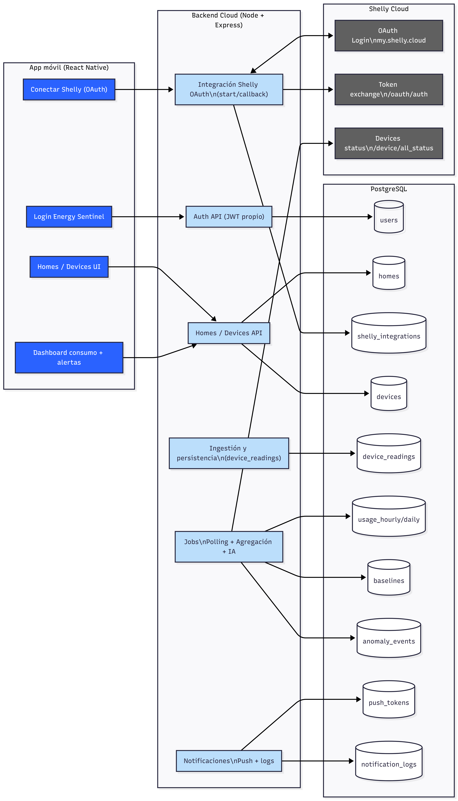
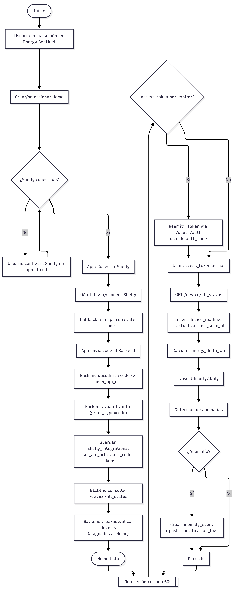

# Energy Sentinel AI

## Documento técnico: arquitectura, flujo de información, reglas de negocio y esquema de base de datos

## 1. Objetivo del sistema

Energy Sentinel AI es una aplicación móvil (React Native) orientada al monitoreo del consumo eléctrico por dispositivo mediante smart plugs Shelly. La solución almacena histórico, genera agregados por hora y por día, habilita detección de anomalías (IA) y permite consultar el consumo desde cualquier lugar a través de un backend propio en la nube.

---

## 2. Arquitectura (Shelly Cloud + OAuth)

### 2.1 Componentes

- **App móvil (React Native):** autenticación propia, gestión de Homes y Devices, visualización de métricas y alertas.
- **API Backend Cloud (Node + Express):** integra OAuth con Shelly, sincroniza métricas, persiste datos, agrega por hora/día y ejecuta detección de anomalías.
- **Shelly Cloud (tercero):** proveedor de estado y métricas; requiere OAuth (Bearer token) y enruta llamadas por `user_api_url`.
- **Base de datos (PostgreSQL):** almacena inventario, telemetría, agregados, baselines, anomalías y bitácoras.

### 2.2 Flujo general

1. El usuario inicia sesión en Energy Sentinel AI.
2. El usuario conecta su cuenta Shelly (OAuth) desde la app.
3. El backend obtiene tokens, determina `user_api_url` y lista dispositivos en Shelly Cloud.
4. El usuario importa dispositivos a un Home (inventario en la tabla `devices`).
5. Jobs del backend consultan Shelly Cloud periódicamente y guardan lecturas crudas y agregadas.
6. La app consume únicamente la API del backend para mostrar consumo, histórico y alertas.

---

## 3. Flujo de información

### 3.1 Onboarding del usuario (Energy Sentinel)

- Registro o inicio de sesión del usuario en Energy Sentinel.
- Creación o selección de un Home (por ejemplo: Casa u Oficina).

### 3.2 Conectar Shelly (OAuth)

**Secuencia resumida:**

1. La app abre el flujo OAuth de Shelly (login/consent).
2. Shelly redirige al callback con `state` y `code`.
3. La app envía el `code` al backend.
4. El backend decodifica el `code` para obtener `user_api_url` y realiza el intercambio en `/oauth/auth` para obtener `access_token` y `refresh_token`.
5. El backend guarda los tokens y el `user_api_url` en `shelly_integrations`.

### 3.3 Descubrir e importar dispositivos

- El backend consulta `/device/all_status` con `Authorization: Bearer <access_token>`.
- Se obtiene lista de dispositivos y sus métricas actuales.
- El usuario selecciona qué dispositivos importar; el backend crea/actualiza registros en `devices` vinculados al `home_id`.

### 3.4 Sincronización periódica (polling) y persistencia

- Un job (por ejemplo, cada 60 segundos) consulta `/device/all_status` para cada integración activa.
- Por cada dispositivo se inserta una fila en `device_readings` y se actualiza `devices.last_seen_at`.
- Se calcula `energy_delta_wh` por dispositivo con base en el contador total (`energy_wh`).
- Jobs adicionales generan agregados en `device_usage_hourly` y `device_usage_daily`.
- Un job de anomalías compara observado vs baseline y crea `anomaly_events`; posteriormente se envían notificaciones push.

### 3.5 Visualización en la app

- La app lista dispositivos desde la tabla `devices` (filtrando por `home_id`).
- La app muestra la lectura más reciente desde `device_readings`.
- Para históricos y rangos (7/15/30 días), la app consulta agregados en `device_usage_hourly` / `device_usage_daily`.
- Alertas y detalles se consultan desde `anomaly_events` y `notification_logs`.

---

## 4. Reglas de negocio (sujetas a cambios)

### 4.1 Seguridad y manejo de tokens

- La app móvil no almacena tokens de Shelly (`access` / `refresh`). Todo token se guarda y gestiona exclusivamente en el backend.
- El backend guarda `auth_code` (el `code` devuelto por el callback OAuth de Shelly).
- El backend usa el `auth_code` para reemitir el `access_token` sin requerir que el usuario vuelva a iniciar sesión.
- **Regla de renovación:** antes de llamar a Shelly Cloud, si `access_token_expires_at <= now() + margen` (ej. 60–120s), entonces se ejecuta la renovación.
- **Renovación (estrategia MVP):** el backend llama a `https://<user_api_url>/oauth/auth` con `grant_type=code` y el `auth_code` almacenado, y actualiza `access_token` y `access_token_expires_at`.
- Si la renovación falla (revocación, credenciales cambiadas, token inválido), la integración cambia a `needs_reauth` y el usuario debe reconectar Shelly.
- `user_api_url` se obtiene del `auth_code` o del `access_token` y se persiste para enrutar correctamente las llamadas.

### 4.2 Inventario vs telemetría

- `devices` es el inventario (qué dispositivos existen y a qué Home pertenecen).
- `device_readings` almacena telemetría cruda a intervalos regulares.
- La app no descubre dispositivos por red; siempre usa el inventario registrado en `devices`.

### 4.3 Cálculo de energía por intervalo

- `energy_wh` representa un contador total acumulado reportado por Shelly (por ejemplo, `aenergy.total`).
- `energy_delta_wh` se calcula como `energy_wh_actual - energy_wh_anterior` por `device_id`.
- Si el delta es negativo (reinicio o inconsistencia), `energy_delta_wh` se guarda como `NULL` (o `0` según política futura) y se conserva evidencia en `raw_payload`.

### 4.4 Agregación (hourly y daily)

- `device_usage_hourly.energy_wh` = suma de `energy_delta_wh` en la hora (excluyendo `NULL`).
- `device_usage_daily.energy_wh` = suma de `energy_delta_wh` en el día según `homes.timezone`.
- Los jobs deben ser idempotentes mediante `UPSERT` usando los índices únicos definidos.

### 4.5 Estado online/offline

- `devices.last_seen_at` se actualiza con cada lectura válida.
- Se considera offline si `now - last_seen_at` excede un umbral (por ejemplo, 2 a 3 intervalos de polling).

### 4.6 Baselines y anomalías (MVP)

- Se requiere un mínimo de datos para entrenar un baseline (por ejemplo, 7 a 14 días).
- Si no hay baseline suficiente, se omiten anomalías basadas en IA o se aplican reglas simples.
- Un evento anómalo genera un registro en `anomaly_events` y puede disparar push notifications.

---

## 5. Esquema de base de datos

Las siguientes tablas documentan cada entidad y sus atributos. La columna **Descripción** indica el propósito y el tipo de información que se almacena.

### `users`

| Atributo        | Descripción                                                                     |
| --------------- | ------------------------------------------------------------------------------- |
| `id`            | Identificador único del usuario (UUID).                                         |
| `email`         | Correo del usuario; se usa para inicio de sesión. Debe ser único.               |
| `password_hash` | Hash seguro de la contraseña del usuario (no se almacena el password en texto). |
| `name`          | Nombre visible del usuario (opcional).                                          |
| `created_at`    | Fecha y hora de creación del registro.                                          |
| `updated_at`    | Fecha y hora de la última actualización del registro.                           |

### `homes`

| Atributo     | Descripción                                                    |
| ------------ | -------------------------------------------------------------- |
| `id`         | Identificador único del Home (UUID).                           |
| `user_id`    | Referencia al dueño del Home (FK a `users.id`).                |
| `name`       | Nombre del Home (por ejemplo: Casa, Oficina).                  |
| `timezone`   | Zona horaria del Home; se usa para agregación diaria correcta. |
| `created_at` | Fecha y hora de creación del registro.                         |
| `updated_at` | Fecha y hora de la última actualización del registro.          |

### `shelly_integrations`

| Atributo                  | Descripción                                                                                                                        |
| ------------------------- | ---------------------------------------------------------------------------------------------------------------------------------- |
| `id`                      | Identificador único de la integración (UUID).                                                                                      |
| `home_id`                 | Home al que pertenece la integración (FK a `homes.id`).                                                                            |
| `client_id`               | Client ID OAuth utilizado; por defecto `shelly-diy` para integraciones DIY.                                                        |
| `user_api_url`            | Host base de Shelly Cloud para el usuario, obtenido del `code` / `access_token` (enruta las llamadas).                             |
| `auth_code`               | Código devuelto por el flujo OAuth (formato JWT-like). Se almacena para reemitir `access_token` sin solicitar re-login al usuario. |
| `access_token`            | Bearer token (JWT) de Shelly Cloud, de vida corta.                                                                                 |
| `refresh_token`           | Token de refresco para renovar el `access_token` cuando expire.                                                                    |
| `access_token_expires_at` | Fecha/hora estimada de expiración del `access_token` (opcional; puede derivarse del JWT).                                          |
| `status`                  | Estado de la integración: `active`, `needs_reauth`, `revoked`.                                                                     |
| `last_sync_at`            | Marca temporal del último sync exitoso contra Shelly Cloud.                                                                        |
| `created_at`              | Fecha y hora de creación del registro.                                                                                             |
| `updated_at`              | Fecha y hora de la última actualización del registro.                                                                              |

### `devices`

| Atributo             | Descripción                                                                                 |
| -------------------- | ------------------------------------------------------------------------------------------- |
| `id`                 | Identificador interno del dispositivo (UUID).                                               |
| `home_id`            | Home al que pertenece el dispositivo (FK a `homes.id`).                                     |
| `vendor`             | Proveedor/fabricante (por ejemplo, `shelly`).                                               |
| `model`              | Modelo del dispositivo (si se detecta o se captura).                                        |
| `display_name`       | Nombre visible configurado por el usuario (por ejemplo, `Pantalla Sala`).                   |
| `ip_address`         | IP local (opcional). Útil para modo LAN futuro o diagnóstico.                               |
| `mac_address`        | Dirección MAC (opcional). Útil para inventario y troubleshooting.                           |
| `external_device_id` | Identificador del dispositivo en Shelly Cloud. Se guarda como texto por formatos variables. |
| `status`             | Estado lógico: `active`, `disabled`, etc.                                                   |
| `last_seen_at`       | Última vez que se obtuvo telemetría válida para el dispositivo.                             |
| `data_source`        | Origen de datos principal: `shelly_cloud`, `shelly_lan`, `manual_import`.                   |
| `telemetry_config`   | Metadatos y paths de telemetría (JSON). Útil para soportar distintos modelos/vendors.       |
| `created_at`         | Fecha y hora de creación del registro.                                                      |
| `updated_at`         | Fecha y hora de la última actualización del registro.                                       |

### `device_readings`

| Atributo              | Descripción                                                                   |
| --------------------- | ----------------------------------------------------------------------------- |
| `id`                  | Identificador incremental de la lectura (`bigserial`).                        |
| `device_id`           | Dispositivo asociado a la lectura (FK a `devices.id`).                        |
| `ts`                  | Timestamp de la lectura. Recomendado almacenar en UTC.                        |
| `power_w`             | Potencia instantánea (Watts).                                                 |
| `voltage_v`           | Voltaje instantáneo (Volts).                                                  |
| `current_a`           | Corriente instantánea (Amperes).                                              |
| `pf`                  | Factor de potencia (si es reportado por el proveedor).                        |
| `relay_on`            | Estado del relay/salida (encendido/apagado).                                  |
| `energy_wh`           | Energía total acumulada (Wh) reportada por el proveedor (contador).           |
| `energy_delta_wh`     | Delta de energía (Wh) entre esta lectura y la anterior del mismo dispositivo. |
| `energy_minute_ts`    | Timestamp base para buckets por minuto (si el proveedor los incluye).         |
| `energy_by_minute_wh` | Arreglo JSON con energía por minuto (si está disponible).                     |
| `source`              | Proveniencia de la lectura: `shelly_cloud`, `shelly_lan`, `direct`, `import`. |
| `raw_payload`         | JSON original completo devuelto por el proveedor, para auditoría y debug.     |

### `device_usage_hourly`

| Atributo        | Descripción                                                   |
| --------------- | ------------------------------------------------------------- |
| `id`            | Identificador incremental del agregado horario (`bigserial`). |
| `device_id`     | Dispositivo asociado (FK a `devices.id`).                     |
| `hour_ts`       | Inicio de la hora (timestamp normalizado).                    |
| `energy_wh`     | Energía consumida en la hora (suma de `energy_delta_wh`).     |
| `avg_power_w`   | Potencia promedio en la hora (promedio de `power_w`).         |
| `max_power_w`   | Potencia máxima registrada en la hora.                        |
| `samples_count` | Cantidad de lecturas consideradas en el agregado.             |

### `device_usage_daily`

| Atributo        | Descripción                                                  |
| --------------- | ------------------------------------------------------------ |
| `id`            | Identificador incremental del agregado diario (`bigserial`). |
| `device_id`     | Dispositivo asociado (FK a `devices.id`).                    |
| `date`          | Fecha del día (según `homes.timezone`).                      |
| `energy_wh`     | Energía consumida en el día (suma de `energy_delta_wh`).     |
| `avg_power_w`   | Potencia promedio del día.                                   |
| `max_power_w`   | Potencia máxima del día.                                     |
| `samples_count` | Cantidad de lecturas consideradas en el agregado.            |

### `device_baselines`

| Atributo        | Descripción                                                        |
| --------------- | ------------------------------------------------------------------ |
| `id`            | Identificador del baseline (UUID).                                 |
| `device_id`     | Dispositivo asociado (FK a `devices.id`).                          |
| `baseline_type` | Tipo de baseline (por ejemplo, perfil horario, percentiles, EWMA). |
| `window_days`   | Ventana de entrenamiento en días (por defecto 14).                 |
| `model_version` | Versión del modelo/algoritmo para trazabilidad.                    |
| `params`        | Parámetros entrenados (JSON) para el baseline.                     |
| `trained_from`  | Inicio del rango temporal de datos usados para entrenar.           |
| `trained_to`    | Fin del rango temporal de datos usados para entrenar.              |
| `created_at`    | Fecha y hora de creación del baseline.                             |

### `anomaly_events`

| Atributo         | Descripción                                                        |
| ---------------- | ------------------------------------------------------------------ |
| `id`             | Identificador del evento anómalo (UUID).                           |
| `device_id`      | Dispositivo asociado (FK a `devices.id`).                          |
| `detected_at`    | Momento en que se detectó la anomalía.                             |
| `window_start`   | Inicio de la ventana evaluada.                                     |
| `window_end`     | Fin de la ventana evaluada.                                        |
| `anomaly_type`   | Tipo de anomalía (alto consumo, pico, etc.).                       |
| `severity`       | Severidad (escala definida por el sistema).                        |
| `score`          | Puntaje del modelo (si aplica).                                    |
| `expected_value` | Valor esperado según baseline/modelo.                              |
| `observed_value` | Valor observado real.                                              |
| `details`        | Detalles adicionales (JSON): umbrales, features, explicación, etc. |

### `user_push_tokens`

| Atributo       | Descripción                                                       |
| -------------- | ----------------------------------------------------------------- |
| `id`           | Identificador del token (UUID).                                   |
| `user_id`      | Usuario dueño del token (FK a `users.id`).                        |
| `token`        | Token push (FCM/APNS). Debe ser único.                            |
| `platform`     | Plataforma del dispositivo móvil (iOS/Android).                   |
| `is_active`    | Indica si el token está activo y debe usarse para notificaciones. |
| `created_at`   | Fecha y hora de alta del token.                                   |
| `last_seen_at` | Última vez que el token fue observado/validado.                   |

### `notification_logs`

| Atributo           | Descripción                                            |
| ------------------ | ------------------------------------------------------ |
| `id`               | Identificador del log (UUID).                          |
| `user_id`          | Usuario al que se intentó notificar (FK a `users.id`). |
| `anomaly_event_id` | Evento asociado (FK opcional a `anomaly_events.id`).   |
| `sent_at`          | Fecha y hora del intento de envío.                     |
| `channel`          | Canal de notificación (por defecto `fcm`).             |
| `status`           | Resultado del envío: `sent`, `failed`, `queued`.       |
| `error_message`    | Mensaje de error si el envío falló.                    |

---

## 6. Notas de implementación

- Para tokens (`access` / `refresh`), se recomienda cifrado en reposo o almacenamiento en un vault / secret manager.
- Se recomienda manejar re-autorización (`needs_reauth`) con una pantalla en la app: **“Reconectar Shelly”**.
- El intervalo de polling puede ajustarse según límites de la API y cantidad de dispositivos.
- El diseño separa inventario (`devices`) de telemetría (`device_readings`) para facilitar escalabilidad.

---

## 7. Diagrama ER

## 8. Diagrama de arquitectura

## 9. Diagrama de actividades / flujo

